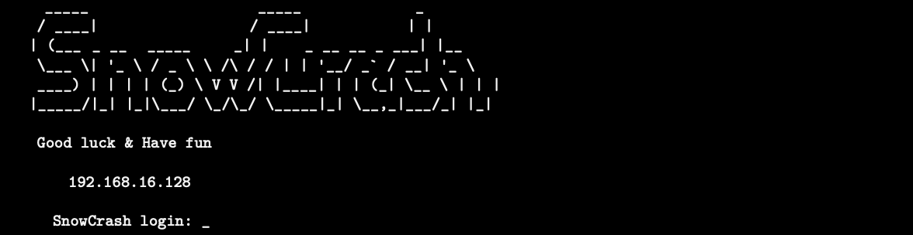

<h1 align="center">
SnowCrash 
</h1>

<h3 align="center"><b>Description</b></h3>

Projet introductif à la sécurité en informatique, Snow Crash a pour but de faire découvrir la sécurité dans différents sous-domaines, avec une approche orientée développeur. Vous allez vous familiariser avec plusieurs langages (ASM/perl/php..), développer une certaine logique pour comprendre des programmes inconnus, et ainsi prendre conscience des problèmes liés à de simples erreurs de programmation .

<b>Solutions : </b>

 * [Level00](level00/Ressources/README.md): find et rot11

 * [Level01](level01/Ressources/README.md): John The Ripper

 * [Level02](level02/Ressources/README.md): Wireshark

----

Credits <a href="https://github.com/Drakauf">shthevak</a>
