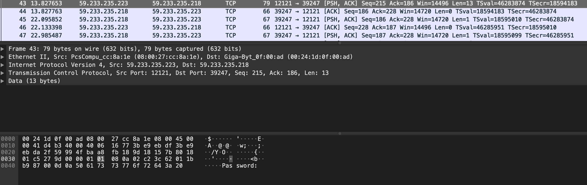

# Level02

Une fois connecté avec le username:motdepasse level02:f2av5il02puano7naaf6adaaf (obtenu dans le flag précédent), nous arrivons sur le home de l'utilisateur level02.  
Nous pouvons y trouver le fichier level02.pcap.  
Les fichiers .pcap sont des fichiers de données en paquets d'un réseau, principalement associés avec Wireshark.  
Nous allons donc récupérer le fichier hors de la VM afin de pouvoir l'ouvrir avec Wireshark.  
Pour cela nous utilisons `scp` :  
```
scp -P 4242 level02@127.0.0.1:~/level02.pcap .
```
(le mot de passe sera demandé : f2av5il02puano7naaf6adaaf)

En ouvrant le fichier avec Wireshark nous pouvons voir à la ligne 43 `password`, on en déduit que ce qui suit est le mot de passe, nous regardons donc attentivement les transmissions suivantes.  


Dans les données des transmissions suivantes nous trouvons les codes suivants : 

|||||||||||||||||||||||
|:---------:|:---------:|:---------:|:---------:|:---------:|:---------:|:---------:|:---------:|:---------:|:---------:|:---------:|:---------:|:---------:|:---------:|:---------:|:---------:|:---------:|:---------:|:---------:|:---------:|:---------:|:---------:|
|data|66| 74 | 5f | 77 | 61 | 6e | 64 | 72 | 7f | 7f | 7f | 4e | 44 | 52 | 65 | 6c | 7f | 4c | 30 |  4c | 0d |
|representation| f | t | _ | w | a | n | d | r | . | . | . | N | D | R | e | l | . | L | 0 | L | . |

Wireshark represente les caracteres non imprimables par des `.` :  
7f (hexa) -> 127 (decimal) = `del` en ascii -> signifie une suppression de caractere  
0d (hexa) -> 13 (decimal) = `cr` en ascii -> signifie un appuie sur la touche `entrée`

on obtient donc le mot de passe suivant : 
`ft_waNDReL0L`

Il ne nous reste donc plus qu'à récupérer le flag :  
```
level02@SnowCrash:~$ su flag02
Password:ft_waNDReL0L
Don't forget to launch getflag !
flag02@SnowCrash:~$ getflag
Check flag.Here is your token : kooda2puivaav1idi4f57q8iq
```
||<h3 align="center"> Documentation </h3>|
|:--------:|:---------:|
|fichier pcap|https://www.reviversoft.com/fr/file-extensions/pcap|
|ascii code|https://supersonique-studio.com/2011/11/code-de-controle-ascii-utiles-cr-lf-vt-etc/|
